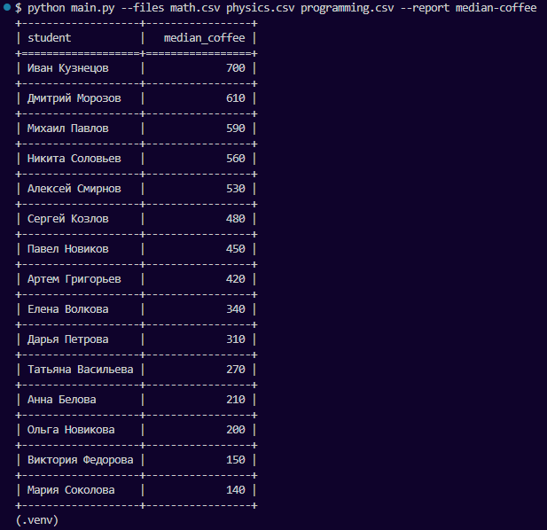
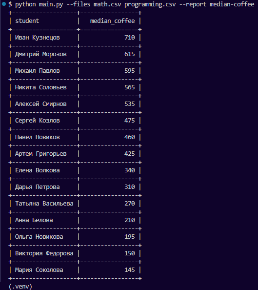
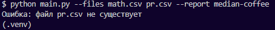
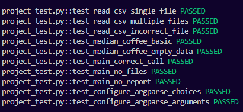

# Скрипт для обработки csv-файлов в отчеты.

- configs.py - настройки для командной строки (argparse)
- project_test.py - тесты
- main.py - основная логика

  * REPORT_TYPE - словарь для команд из терминала и их функций (все запускается через него)
  * median_coffee - функция для вычисления медиан по выпитому кофе
  * read_csv - читает все файлы и преобразует в двумерный массив (без заголовков)
  * console_output_data - выводит отчет в терминал в табличном виде (tabulate)

## Стек

- Python 3.11.0
- argparse 1.4.0
- statistics 1.0.3.5
- tabulate 0.10.0
- pytest 9.0.2

# Скрины

  
Нажмите, чтобы посмотреть пример отчета

  

  
Нажмите, чтобы посмотреть еще один пример отчета

  

  
Нажмите, чтобы посмотреть вывод ошибки

  

  
Нажмите, чтобы посмотреть тесты

  

### Made by Tulen4eG
Николашин Тимофей
[telegram](https://t.me/Tulen4eg)
